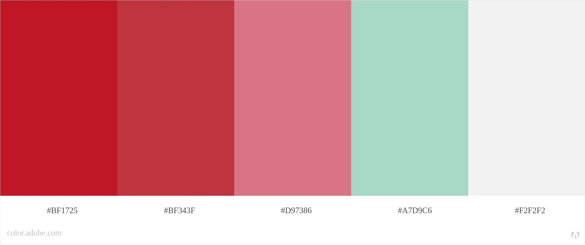
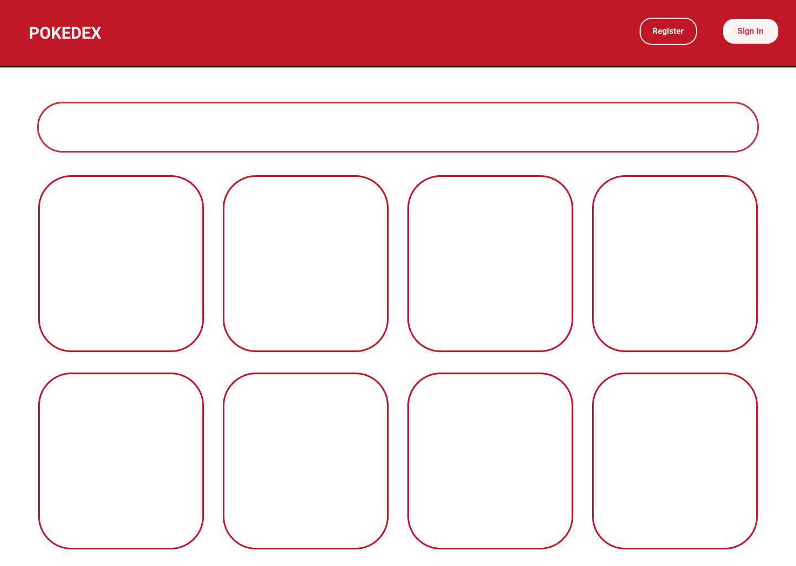
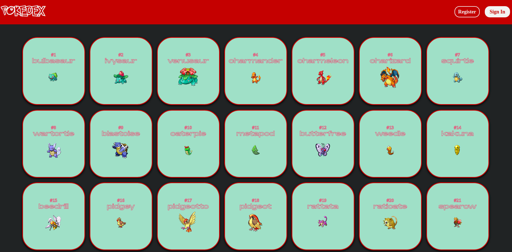
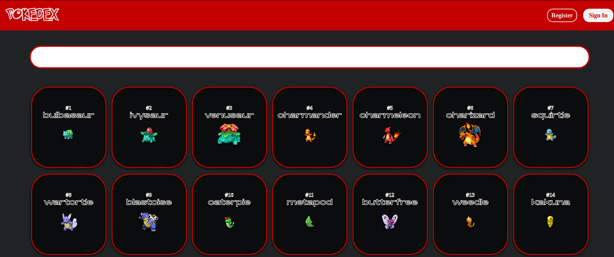
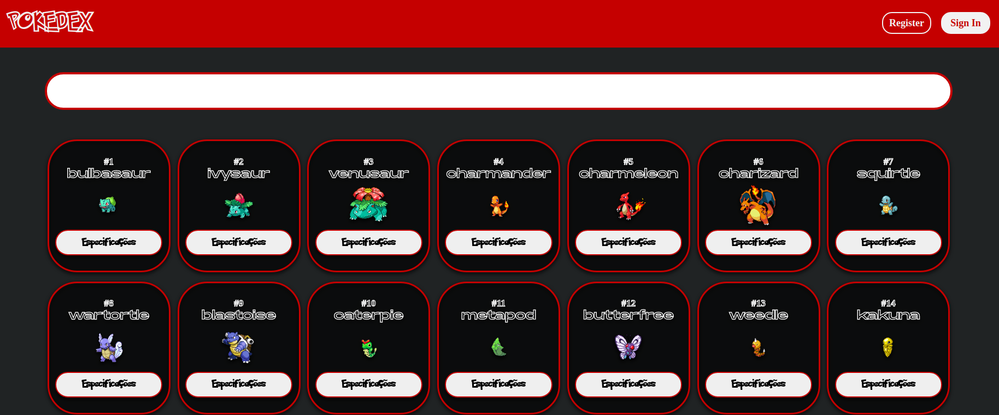
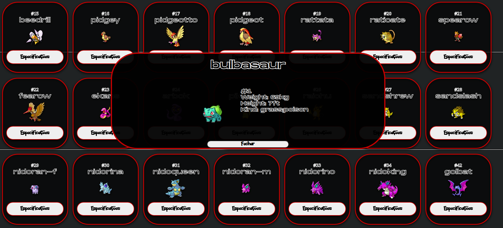
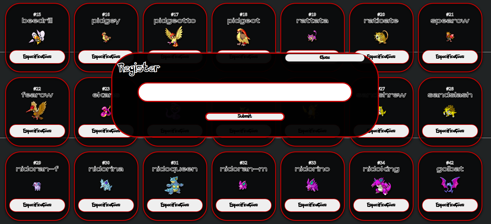
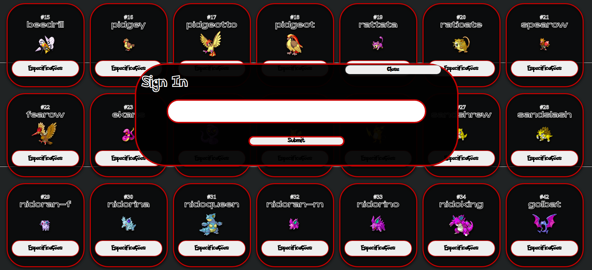

## Project Pokedex CJR 2020/2 in React

#### project running [H E R E](https://lveloz.netlify.app/)

### Functionalities:

- [x] Exploration: View all the Pokemons.

- [x] Information: View the pokemon specifications. 

- [x] Search Bar: Possibility to search for a pokemon through the search bar.

- [ ] Authentication: Login in the plataform.

- [ ] Favorite: Favorite a pokemon and view when authenticated on the plataform.

## How to Install

clone the repo:

`
    git clone (repo)
`

install dependencies:

`
    npm start
`

run the project:

`
    npm start
`

#### Color Palette

#### Using UX and UI for a better experience.

`WireFrame in development`

`WireFrame in development`

`WireFrame in development`

`WireFrame base`

`WireFrame spec`

`Register Area`

`Login Area`
